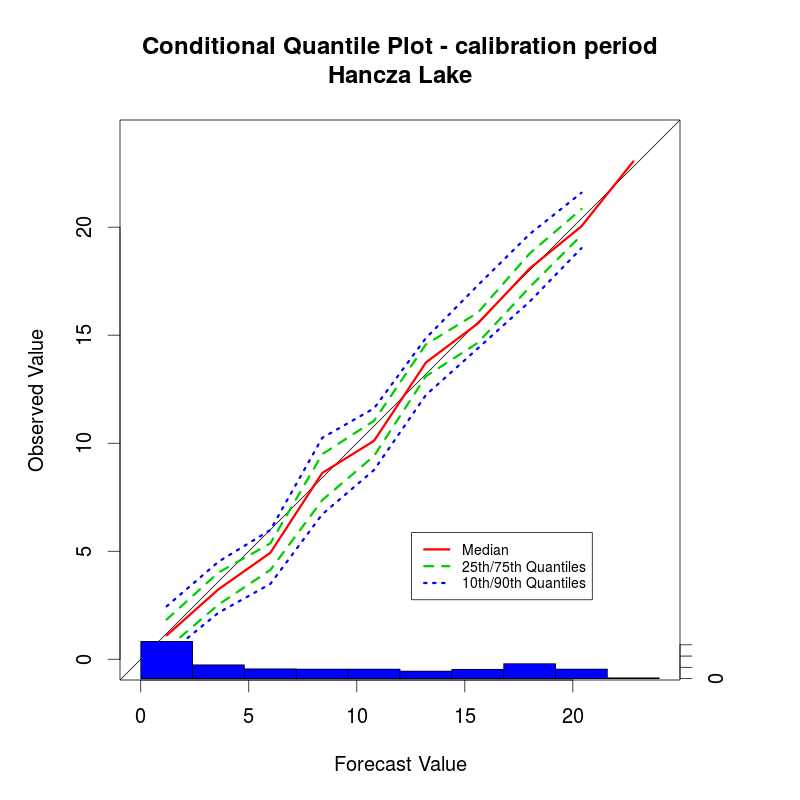
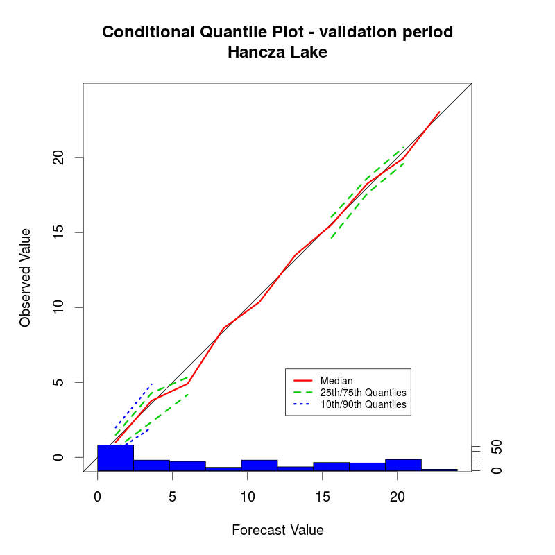

# air2water

Some diagnostic plots obtained with the code included in the file verify.R:

Lake Hancza - Calibration - (1972-2015) - looks good...

Lake Hancza - Validation - (2001-2015) - .. still good :)

